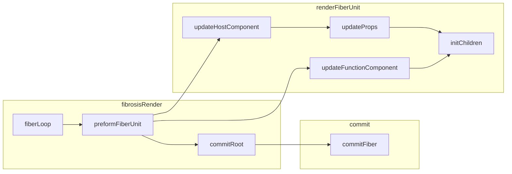

# IM-React a.k.a. mini-react

> You Think You're a ...?
> Yes.I think **IM**.

```mermaid
  flowchart LR
    fiberLoop["fiberLoop"]
    preformFiberUnit["preformFiberUnit"]
    commitRoot["commitRoot"]
    commitFiber["commitFiber"]

    subgraph "fibrosisRender"
      fiberLoop  -->  preformFiberUnit  -->  commitRoot
    end

    subgraph "commit"
      commitRoot  -->  commitFiber
    end

    subgraph "renderFiberUnit"
      preformFiberUnit  -->  updateFunctionComponent --> initChildren
      preformFiberUnit  -->  updateHostComponent --> updateProps --> initChildren
    end

```
