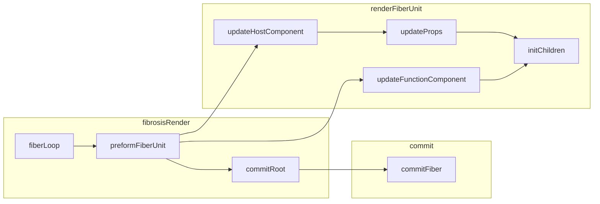
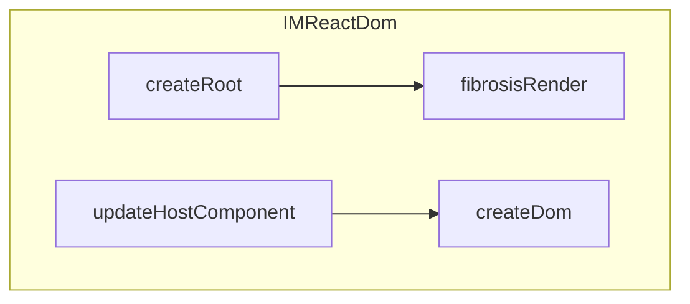

1-3
做了
jsx render 的函数
任务调度函数 preformFiberUnit

```mermaid
  flowchart LR
    fiberLoop["fiberLoop"]
    preformFiberUnit["preformFiberUnit"]
    commitRoot["commitRoot"]
    commitFiber["commitFiber"]

    subgraph "fibrosisRender"
      fiberLoop  -->  preformFiberUnit  -->  commitRoot
    end

    subgraph "commit"
      commitRoot  -->  commitFiber
    end

    subgraph "renderFiberUnit"
      preformFiberUnit  -->  updateFunctionComponent --> initChildren
      preformFiberUnit  -->  updateHostComponent --> updateProps --> initChildren
    end

```

```mermaid

   flowchart
    createRoot["createRoot"]
    createDom["createDom"]

    subgraph "IMReactDom"
      createRoot --> fibrosisRender
      updateHostComponent --> createDom
    end
```
